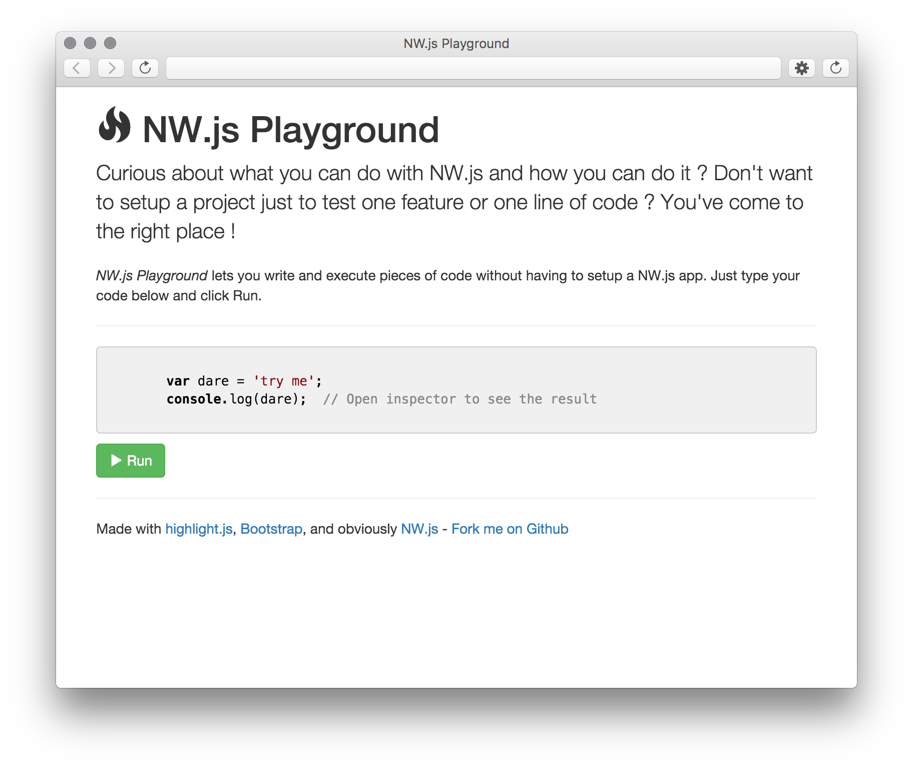

# nw-playground-app

> Quick experiments with NW.js

Curious about what you can do with NW.js and how you can do it ?
Don't want to setup a project just to test one feature or one line of code ?

_NW.js Playground_ lets you write and execute pieces of code without having
to setup a NW.js app. Just type your code and click Run.

